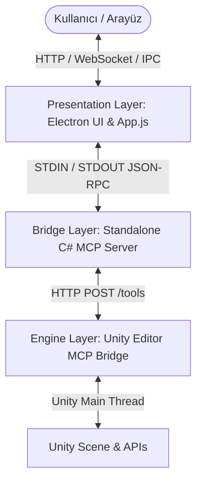

# Unity AI Givelopment Studio - Sistem Mimarisi ve Çalışma Prensipleri

Bu doküman, Unity AI Givelopment Studio mimarisinin nasıl çalıştığını, bileşenlerin birbiriyle nasıl haberleştiğini ve arka planda dönen tüm süreçleri detaylıca açıklamaktadır.

---

## 1. Genel Mimari Şeması

Sistem, birbiriyle entegre çalışan 3 ana katmandan oluşmaktadır:

---

## 2. Katmanlar ve Görevleri

### A. Sunum Katmanı (Presentation Layer - Electron & Web Client)
* **Konum**: `desktop-app/` ve `web-client/`
* **Görevi**: Kullanıcıyla etkileşime geçen, sohbet ekranını barındıran ve Unity canlı verilerini gösteren görsel katmandır.
* **Ana Bileşenler**:
  * **`index.html` & `style.css`**: Çerçevesiz (frameless) pencere tasarımı, LT Internet yazı tipi entegrasyonu, koyu monochrome tema ve animasyonlar.
  * **`app.js`**: Arayüzün beynidir. API isteklerini yönetir, gelen mesajları işler, hiyerarşiyi (Hierarchy), Asset Browser'ı, Script Viewer'ı ve Kamera görüntüsünü Unity'den sessizce (silent refresh) çekerek günceller.
  * **Derin Düşünme (Deep Thinking)**: Modelden gelen `<think>...</think>` bloklarını ayıklayarak özel akordeon kutuları içinde gösterir ve düşünme sürelerini hesaplar.
  * **Kayan Sohbet Penceresi (Rolling Context)**: Bedrock/Kiro API'lerinin tıkanmasını ve `400 Context Limit` hatalarını önlemek için sohbet geçmişini temizler ve son 14 mesaj ile sınırlar. Assistant mesajlarındaki eski `tool_calls` dizilerini sıfırlayarak `TOOL_USE_RESULT_MISMATCH` hatasını engeller.
  * **Sohbet Geçmişi (LocalStorage)**: Konuşmaları tarayıcı hafızasına kaydederek geçmiş sohbetlerin yüklenmesini veya silinmesini sağlar.

### B. Köprü Katmanı (Bridge Layer - Standalone C# MCP Server)
* **Konum**: `mcp-server-cs/` -> Derlenmiş hali: `mcp-server-cs/mcp-server.exe`
* **Görevi**: Arayüz (veya Claude Desktop) ile Unity Editörü arasında JSON-RPC 2.0 standartlarına uygun olarak komut taşımacılığı yapan hafif (lightweight) bir konsol uygulaması köprüsüdür.
* **Nasıl Çalışır?**:
  * Node.js bağımlılığı olmadan, doğrudan Windows'un yerleşik C# derleyicisi (`csc.exe`) ile derlenmiştir.
  * Standart giriş/çıkış (stdin/stdout) kanallarını dinler.
  * Gelen araç (tool) isteklerini (örn: `create_gameobject`, `download_asset`) yakalar ve Unity Editöründeki yerel HTTP sunucusuna (`http://localhost:5000/tools/...`) yönlendirir.

### C. Motor Katmanı (Engine Layer - Unity Editor MCP Bridge)
* **Konum**: `unity-project/Assets/Editor/MCPBridge/`
* **Görevi**: Unity Editörü içinde bir HTTP sunucusu açarak gelen komutları doğrudan Unity motoru üzerinde çalıştırır ve sahneyi manipüle eder.
* **Ana Bileşenler**:
  * **`MCPHttpServer.cs`**: Arka planda bir HTTP dinleyicisi açar. Gelen istekleri Unity'nin ana iş parçacığında (Main Thread) güvenle çalıştırmak için bir kuyruğa (`_pendingRequests`) ekler.
  * **`MCPToolRegistry.cs`**: Projedeki tüm araçları (`IMCPToolProvider` arayüzünü uygulayan sınıfları) otomatik olarak tarar ve çalışma zamanında kaydeder.
  * **`SceneTools.cs`**:
    * **Primitive Fallbacks**: Eğer oluşturulan objenin adı "cube", "sphere", "plane", "cylinder" gibi kelimeler içeriyorsa, boş ve görünmez bir obje oluşturmak yerine otomatik olarak Unity'nin görünür **ilkel (primitive) 3D şekillerini** oluşturur.
    * **Mekansal Serileştirme**: Sahne ağacı çekildiğinde her objenin dünya koordinatlarındaki **pozisyon (position), rotasyon (rotation) ve ölçek (scale)** bilgilerini de AI'a bildirir.
  * **`AssetDownloadTools.cs`**: İnternetten dinamik olarak `.obj`, `.fbx` modelleri veya `.unitypackage` indiren `download_asset` ile Cinemachine, ProBuilder, UI Toolkit gibi paketleri asenkron kuran `manage_package` araçlarını yönetir.

---

## 3. Adım Adım İstek/Komut Akış Döngüsü (Lifecycle of a Request)

Aşağıdaki süreç, yapay zekanın sahnede bir nesne oluşturma komutu vermesinden sonucun arayüze yansımasına kadar olan döngüyü gösterir:

1. **İstek Tetiklenir**:
   Kullanıcı sohbet alanına `"Sahneye bir küp ekle"` yazar.
2. **AI Karar Verir**:
   Yapay zeka modeli, bu isteği gerçekleştirmek için `create_gameobject` aracını çağırmaya karar verir ve argümanları belirler: `{ "name": "Küp1", "position": [0, 0, 0] }`.
3. **C# MCP Server İstek Alma**:
   Arayüz, bu araç çağrısını standard input (stdin) yoluyla `mcp-server.exe`'ye iletir.
4. **Unity HTTP İletimi**:
   C# Köprü sunucusu, isteği çözümler ve Unity Editöründe çalışan lokal HTTP sunucusuna POST isteği gönderir:
   `POST http://localhost:5000/tools/create_gameobject`
5. **Main-Thread Dispatcher (Ana İş Parçacığı Yönlendiricisi)**:
   İstek arka plandaki HTTP iş parçacığına ulaşır. Unity API'leri sadece ana iş parçacığında (Main Thread) çalışabildiği için, bu istek `_pendingRequests` kuyruğına alınır.
6. **Unity Güncelleme Döngüsü (`Update Loop`)**:
   Unity Editörünün her karede tetiklenen `EditorApplication.update` döngüsü kuyruğu kontrol eder, isteği çeker ve çalıştırır.
7. **Primitive Algılama ve Oluşturma**:
   `SceneTools` objenin adında "Küp" geçtiğini algılar. Boş nesne yerine `GameObject.CreatePrimitive(PrimitiveType.Cube)` komutunu tetikler. Objeye varsayılan MeshRenderer, BoxCollider ve Default Material atanır.
8. **Ertelenmiş İsteklerin Tamamlanması (`__DEFERRED__`)**:
   * *Eğer işlem anında bitiyorsa*: Sonuç JSON formatında HTTP yanıtına yazılır.
   * *Eğer asenkron bir işlemse (örn: Paket indirme)*: Yanıt `"__DEFERRED__"` olarak işaretlenir. Unity arka planda paketi indirip derlemeyi bitirene kadar HTTP bağlantısını açık tutar. Derleme tamamlandığında `WaitHandle.Set()` tetiklenerek istek sonlandırılır.
9. **Arayüz Güncelleme**:
   HTTP yanıtı köprü sunucusu üzerinden Electron arayüzüne ulaşır. `app.js` sohbet ekranında yeşil renkli "Tamamlandı" kutusunu çizer, sohbet geçmişini kaydeder ve sahne ağacını sessizce yenileyerek yeni küpün hiyerarşide anında görünmesini sağlar.

---

## 4. Hata ve Kilitlenme Yönetimi

* **Hata Tünelleme (Error Piping)**: Arayüzde veya araç çalıştırılırken oluşan herhangi bir kritik hata, Electron IPC kanalı aracılığıyla ana terminale (PowerShell/CMD) anında renk kodlu ANSI logları olarak yazdırılır.
* **API Context Limit Koruması**: Konuşma uzadıkça biriken araç çıktıları ve eski mesajlar periyodik olarak budanır. Böylelikle modelin hafıza sınırı aşılmaz ve kilitlenmeler yaşanmaz.
